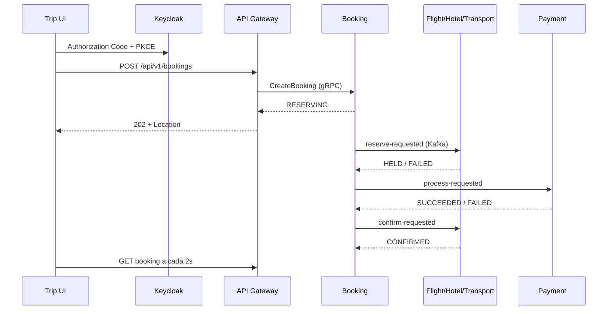

# Quarkus Trip Platform

Plataforma distribuída de reservas em Quarkus 3.33.2, Java 21, gRPC e Kafka. A API pública é REST/OIDC e a interface React permite operar toda a jornada localmente.

## Fluxo principal



Recursos ficam `HELD` por até 15 minutos. O pagamento ocorre antes da confirmação definitiva. Falhas iniciam compensação e falhas de liberação ou reembolso levam a `MANUAL_REVIEW`.

## Módulos

- `trip-ui`: React 19, Vite 8, TypeScript, Keycloak PKCE e TanStack Query.
- `contracts`: Protobuf, envelope de eventos, tópicos e JSON Schemas v1.
- `api-gateway-service`: REST, JWT/OIDC, roles, rate limiting Redis e REST→gRPC.
- `booking-service`: estado agregado e orquestrador da Saga.
- `flight-service`, `hotel-service`, `transport-service`: catálogo e inventário transacional.
- `payment-service`: cobrança e reembolso idempotentes com adaptador `pm_test_*`.
- `user-service`: perfil vinculado ao `sub` do Keycloak, sem credenciais.
- `notification-service`: histórico MongoDB e entrega local via Mailpit.

## Executar com Docker

Requisitos: Docker Compose. O build das aplicações usa Java 21 e Node 24 dentro das imagens.

```bash
docker compose up --build
```

Se outro projeto ou uma instalação local já estiver usando as portas padrão, copie `.env.example` para `.env` antes de subir a stack. Isso altera somente as portas publicadas no Windows; a comunicação entre contêineres permanece isolada pelos nomes `postgres`, `mongodb`, `redis` e `kafka`.

Endereços locais:

- Interface: `http://localhost:3000`
- API/Swagger: `http://localhost:8080/q/swagger-ui`
- Keycloak: `http://localhost:8180`
- Mailpit: `http://localhost:8025`
- Jaeger: `http://localhost:16686`

## Observabilidade distribuída

Os serviços enviam traces OTLP diretamente ao Jaeger. A stack local mantém até 10.000 traces em memória e limita o contêiner a 512 MB; os dados são descartados quando o Jaeger reinicia.

Na interface do Jaeger:

- `Search` mostra traces completos de REST, gRPC, outbox, Kafka, inbox e SQL.
- `Dependencies` calcula o grafo entre serviços a partir dos traces mantidos em memória.
- Os atributos `booking.id`, `event.id`, `saga.state`, `payment.operation` e `compensation.reason` permitem filtrar uma execução específica.

Como o armazenamento é efêmero, depois de recriar o contêiner faça uma requisição autenticada pela UI antes de pesquisar. Selecione `api-gateway-service`, mantenha o período em `Last Hour` e use `Find Traces`.

Para conferir se a plataforma está sendo executada pelo Docker antes de iniciar um serviço local:

```bash
docker compose ps
```

Não execute o mesmo microsserviço simultaneamente no host e no Compose, pois ambos consumiriam o mesmo grupo Kafka. Para desenvolver apenas um serviço no host, pare primeiro o correspondente no Docker com `docker compose stop <serviço>`. PostgreSQL e MongoDB instalados no Windows não são usados pelos contêineres; dentro do Compose, os serviços se conectam pelos nomes `postgres` e `mongodb`.

Para conferir quais portas foram efetivamente publicadas, use `docker compose ps`. Em uma execução com `.env.example`, a UI permanece em `http://localhost:3000` e o Gateway fica em `http://localhost:18080`. Se também alterar `TRIP_UI_HOST_PORT`, atualize os redirects e web origins do cliente no Keycloak.

Usuários locais:

- `demo/demo`: role `USER`.
- `admin/admin`: roles `USER` e `ADMIN`.

O cadastro de novos usuários está disponível pelo link **Register** aberto a partir da UI. A URL `/admin` do Keycloak pertence ao console administrativo do realm `master` e não oferece cadastro de clientes da aplicação.

## Desenvolvimento da UI

Requisitos: Node 24 e npm.

```bash
cd trip-ui
npm ci
npm run dev
```

O arquivo `.env.example` contém os endpoints padrão. A UI mantém tokens somente na memória e armazena em `sessionStorage` apenas o rascunho sem dados pessoais e a chave idempotente da tentativa ativa.

Principais rotas:

- `/`: reservas recentes.
- `/catalog/flights`, `/catalog/hotels`, `/catalog/transports`: catálogos.
- `/bookings/new`: revisão e envio do rascunho.
- `/bookings/{id}`: polling e cancelamento da Saga.
- `/profile`: perfil do usuário.
- `/admin`: cadastro de catálogo, somente para `ADMIN`.

## Verificação

O módulo `trip-ui` participa do reactor Maven. O comando raiz instala Node/npm isolados, executa testes frontend e produz o bundle:

```bash
mvn verify
```

Também é possível validar apenas o frontend:

```bash
cd trip-ui
npm run test
npm run build
npm run e2e
```

Os testes Playwright exigem a stack completa em execução.

## Garantias de consistência

- `bookingId` é a chave Kafka dos eventos da Saga.
- Domínio e outbox são gravados na mesma transação; inbox com chave única elimina efeitos duplicados.
- Assentos usam lock pessimista e índice único parcial.
- Quartos e transportes usam intervalos `[início, fim)` e exclusion constraints PostgreSQL.
- Valores monetários usam `amountMinor`; referências de pagamento são tokenizadas.
- Redis nunca é fonte de verdade para inventário.

Os volumes são descartáveis nesta versão. Para recriar a estrutura local: `docker compose down -v`.
