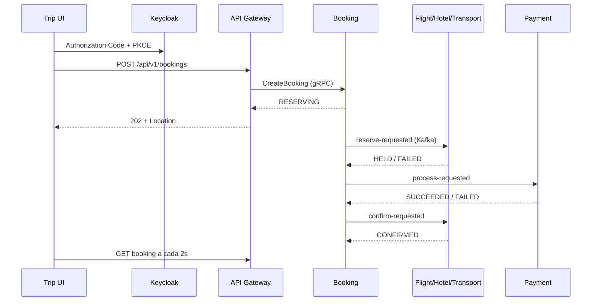

# Quarkus Trip Platform

Plataforma distribuída de reservas em Quarkus 3.33.2, Java 21, gRPC e Kafka. A API pública é REST/OIDC e a interface React permite operar toda a jornada localmente.

## Fluxo principal



Recursos ficam `HELD` por até 15 minutos. O pagamento ocorre antes da confirmação definitiva. Falhas iniciam compensação e falhas de liberação ou reembolso levam a `MANUAL_REVIEW`.

## Módulos

- `trip-ui`: React 19, Vite 8, TypeScript, Keycloak PKCE e TanStack Query.
- `contracts`: Protobuf, envelope de eventos, tópicos e JSON Schemas v1.
- `api-gateway-service`: REST, JWT/OIDC, roles, rate limiting Redis e REST→gRPC.
- `booking-service`: estado agregado e orquestrador da Saga.
- `flight-service`, `hotel-service`, `transport-service`: catálogo e inventário transacional.
- `payment-service`: cobrança e reembolso idempotentes com adaptador `pm_test_*`.
- `user-service`: perfil vinculado ao `sub` do Keycloak, sem credenciais.
- `notification-service`: histórico MongoDB e entrega local via Mailpit.

## Executar com Docker

Requisitos: Docker Compose. O build das aplicações usa Java 21 e Node 24 dentro das imagens.

O Keycloak também usa uma imagem local pré-otimizada. O `kc.sh build` é executado durante `docker compose ... --build`; nos reinícios seguintes o contêiner usa `start --optimized` e não repete a augmentation do Quarkus.

O Compose usa profiles explícitos para impedir que toda a plataforma seja iniciada por engano:

| Profile | Conteúdo |
|---|---|
| `core` | Gateway, Booking, Flight, Payment, UI, PostgreSQL, Redis, Kafka e Keycloak |
| `full` | Tudo do `core`, mais Hotel, Transport, User, Notification, MongoDB e Mailpit |
| `observability` | Jaeger |
| `metrics` | Prometheus e Grafana |

Para iniciar o fluxo mínimo em JVM:

```powershell
docker compose --profile core up -d --build
```

Para iniciar todo o produto em JVM, sem ferramentas extras:

```powershell
docker compose --profile full up -d --build
```

Um `docker compose up` sem profile não seleciona serviços. Para parar contêineres de todos os profiles preservando os dados, use `docker compose --profile "*" down` sem `-v`.

### Runtime nativo

O profile Maven `native` inclui `contracts` como dependência JVM e gera executáveis nativos para Gateway, Booking, Flight, Payment e Notification. Hotel, Transport e User permanecem JVM por enquanto. O build é sequencial, executado pelo Mandrel em contêiner e limitado a 5 GiB de heap.

Antes de compilar, pare a stack e execute o preflight:

```powershell
docker compose --profile "*" down
.\scripts\check-native-prereqs.ps1
mvn verify -Pnative
```

O build nativo pode demorar e precisa de aproximadamente 8 GB disponíveis no Docker e 8 GiB livres em disco. O preflight apenas verifica recursos: ele nunca remove volumes, imagens ou caches.

Essa demora acontece durante a compilação: o Mandrel analisa antecipadamente toda a aplicação para produzir um executável que inicia mais rápido e usa menos RAM. Para o ciclo diário de desenvolvimento, prefira a execução JVM com `docker compose --profile core up -d --build`. Depois que os binários nativos estiverem prontos, iniciar os contêineres nativos também é rápido.

Ao iterar em código já validado, é possível pular os testes e recompilar somente um serviço:

```powershell
# Todos os serviços nativos, sem repetir os testes
mvn package -Pnative -DskipTests

# Apenas o Payment e as dependências necessárias
mvn package -Pnative -DskipTests -pl payment-service -am
```

Não execute builds `native-image` em paralelo quando o Docker estiver limitado a 8 GiB. A pequena redução de tempo costuma ser anulada pela pressão de memória, paginação em disco ou encerramento por OOM.

Para iniciar o `core` usando os binários gerados:

```powershell
docker compose -f docker-compose.yml -f docker-compose.native.yml --profile core up -d --build
```

Para iniciar o produto completo, com os cinco serviços prioritários em modo nativo:

```powershell
docker compose -f docker-compose.yml -f docker-compose.native.yml --profile full up -d --build
```

Se outro projeto ou uma instalação local já estiver usando as portas padrão, copie `.env.example` para `.env` antes de subir a stack. Isso altera somente as portas publicadas no Windows; a comunicação entre contêineres permanece isolada pelos nomes `postgres`, `mongodb`, `redis` e `kafka`.

Endereços locais:

- Interface: `http://localhost:3000`
- API/Swagger: `http://localhost:8080/q/swagger-ui`
- Keycloak: `http://localhost:8180`
- Mailpit: `http://localhost:8025`
- Jaeger: `http://localhost:16686`
- Prometheus: `http://localhost:9090`
- Grafana: `http://localhost:3001`

## Observabilidade distribuída

Os serviços mantêm a instrumentação distribuída compilada, mas usam `quarkus.otel.sdk.disabled=true` no profile enxuto e não geram lotes OTLP enquanto Jaeger não estiver selecionado. O override de observabilidade reativa o SDK; inicie-o antes de gerar o fluxo que deseja inspecionar. Para iniciar `core` com traces:

```powershell
docker compose -f docker-compose.yml -f docker-compose.observability.yml --profile core --profile observability up -d --build
```

No runtime nativo, inclua os três arquivos:

```powershell
docker compose -f docker-compose.yml -f docker-compose.native.yml -f docker-compose.observability.yml --profile core --profile observability up -d --build
```

A stack local mantém até 10.000 traces em memória e limita o Jaeger a 384 MiB; os dados são descartados quando o contêiner reinicia.

Na interface do Jaeger:

- `Search` mostra traces completos de REST, gRPC, outbox, Kafka, inbox e SQL.
- `Dependencies` calcula o grafo entre serviços a partir dos traces mantidos em memória.
- Os atributos `booking.id`, `event.id`, `saga.state`, `payment.operation` e `compensation.reason` permitem filtrar uma execução específica.

Como o armazenamento é efêmero, depois de recriar o contêiner faça uma requisição autenticada pela UI antes de pesquisar. Selecione `api-gateway-service`, mantenha o período em `Last Hour` e use `Find Traces`.

## Métricas opcionais

Os serviços Quarkus já expõem `/q/metrics`. Prometheus e Grafana permanecem parados até o profile `metrics` ser solicitado:

```powershell
docker compose --profile core --profile metrics up -d --build
```

Prometheus mantém no máximo seis horas ou 256 MB de dados efêmeros. O Grafana abre sem login em modo de leitura e provisiona o dashboard **Trip Platform - Runtime e Saga**. O acesso administrativo local usa `admin/admin`.

Para executar tudo em runtime nativo com tracing e métricas:

```powershell
docker compose -f docker-compose.yml -f docker-compose.native.yml -f docker-compose.observability.yml --profile full --profile observability --profile metrics up -d --build
```

Para conferir se a plataforma está sendo executada pelo Docker antes de iniciar um serviço local:

```bash
docker compose --profile full --profile observability --profile metrics ps
```

Não execute o mesmo microsserviço simultaneamente no host e no Compose, pois ambos consumiriam o mesmo grupo Kafka. Para desenvolver apenas um serviço no host, pare primeiro o correspondente no Docker com `docker compose stop <serviço>`. PostgreSQL e MongoDB instalados no Windows não são usados pelos contêineres; dentro do Compose, os serviços se conectam pelos nomes `postgres` e `mongodb`.

Para conferir quais portas foram efetivamente publicadas, use `docker compose --profile full ps`. Em uma execução com `.env.example`, a UI permanece em `http://localhost:3000` e o Gateway fica em `http://localhost:18080`. Se também alterar `TRIP_UI_HOST_PORT`, atualize os redirects e web origins do cliente no Keycloak.

Usuários locais:

- `demo/demo`: role `USER`.
- `admin/admin`: roles `USER` e `ADMIN`.
- `operator/operator`: roles `USER` e `OPERATOR`.

O cadastro de novos usuários está disponível pelo botão **Criar conta** na tela inicial. Login, cadastro, mensagens e atualização obrigatória de perfil usam o tema visual `trip`; português brasileiro é o idioma padrão e inglês permanece disponível no seletor do Keycloak. A URL `/admin` pertence ao console administrativo do realm `master` e não oferece cadastro de clientes da aplicação.

### Tema do Keycloak

O tema está em `infra/keycloak/themes/trip` e herda de `keycloak.v2`. Ele adiciona somente CSS, mensagens e assets locais, evitando cópias dos templates FreeMarker da distribuição. A imagem precisa ser reconstruída sempre que esses arquivos mudarem:

```powershell
docker compose --profile core build keycloak
docker compose --profile core up -d --force-recreate keycloak trip-ui
```

Se o navegador ainda mostrar o tema anterior, faça uma atualização forçada (`Ctrl+F5`). Não use `down -v` para atualizar o tema: remover volumes também apagaria os dados locais. Recuperação de senha e verificação de e-mail continuam desabilitadas no profile `core`, que não possui SMTP.

## Desenvolvimento da UI

Requisitos: Node 24 e npm.

```bash
cd trip-ui
npm ci
npm run dev
```

O arquivo `.env.example` contém os endpoints padrão. A UI mantém tokens somente na memória e armazena em `sessionStorage` apenas o rascunho sem dados pessoais e a chave idempotente da tentativa ativa.

Principais rotas:

- `/`: reservas recentes.
- `/catalog/flights`, `/catalog/hotels`, `/catalog/transports`: catálogos.
- `/packages`: pacotes publicados pela companhia.
- `/bookings/new`: revisão e envio do rascunho.
- `/bookings/{id}`: polling e cancelamento da Saga.
- `/profile`: perfil do usuário.
- `/admin`: cadastro de catálogo, somente para `ADMIN`.
- `/operator`: painel da companhia para catálogo, pacotes e reservas em nome de passageiros.
- `/operator/access`: entrada e cadastro orientado para contas de companhia.

O fluxo do operador usa o `user-service`, portanto execute o profile `full`. O passageiro precisa ter salvo seu perfil ao menos uma vez para aparecer na pesquisa por nome ou e-mail. Uma reserva criada pelo operador pertence ao passageiro selecionado e também permanece visível para o operador que a cadastrou. Pacotes reutilizam itens do rascunho e a disponibilidade real continua sendo validada pela Saga no momento da reserva.

O serviço `keycloak-bootstrap` cria ou atualiza de forma idempotente a role e o usuário local `operator`, inclusive quando o volume do Keycloak já existe. Ele não remove usuários nem recria o realm.

O cadastro iniciado em `/operator/access` cria a conta responsável, mas não concede privilégios empresariais automaticamente. Um administrador deve atribuir a role `OPERATOR`; no ambiente local, `operator/operator` já é provisionado pelo bootstrap.

## Verificação

O módulo `trip-ui` participa do reactor Maven. O comando raiz instala Node/npm isolados, executa testes frontend e produz o bundle:

```bash
mvn verify
```

O build nativo seletivo é validado separadamente:

```powershell
mvn verify -Pnative
```

Para medir tempo até `healthy` e memória após 60 segundos de estabilização:

```powershell
.\scripts\measure-compose.ps1 -Profile core -Mode jvm
.\scripts\measure-compose.ps1 -Profile core -Mode native -Observability
```

Os relatórios JSON e CSV são gravados em `target/performance` e não entram no Git. O medidor recria contêineres, mas não remove volumes.

Também é possível validar apenas o frontend:

```bash
cd trip-ui
npm run test
npm run build
npm run e2e
```

Os testes Playwright exigem a stack completa em execução.

## Garantias de consistência

- `bookingId` é a chave Kafka dos eventos da Saga.
- Domínio e outbox são gravados na mesma transação; inbox com chave única elimina efeitos duplicados.
- Assentos usam lock pessimista e índice único parcial.
- Quartos e transportes usam intervalos `[início, fim)` e exclusion constraints PostgreSQL.
- Valores monetários usam `amountMinor`; referências de pagamento são tokenizadas.
- Redis nunca é fonte de verdade para inventário.

Os volumes são descartáveis nesta versão. Use `docker compose down -v` somente quando quiser apagar deliberadamente bancos, tópicos e usuários locais.

## Observabilidade por reserva

Com o profile `observability` ativo, a página `/bookings/{id}` consulta o Jaeger pelo Gateway e mostra:

- tempo total observado e duração das etapas da Saga;
- conexões entre os serviços com badges `REST`, `gRPC` e `Kafka`;
- retries, duplicações, DLQ, spans com falha, compensação e reembolso;
- atalhos para o trace principal, traces relacionados e o grafo global de dependências.

O navegador nunca acessa a API interna do Jaeger para obter dados. O Gateway primeiro confirma pelo Booking gRPC que a reserva pertence ao usuário autenticado e então consulta o Jaeger. A API protegida usada pela tela é:

```http
GET /api/v1/bookings/{bookingId}/observability
```

O `BookingView` expõe somente o `traceId` de 32 caracteres hexadecimais. `traceparent` e `tracestate` permanecem internos. Quando o Jaeger estiver desligado, o circuito estiver aberto ou o trace tiver expirado, o endpoint responde `200` com `available=false`; a consulta e o cancelamento da reserva continuam funcionando normalmente.

Durante uma Saga ativa, a UI atualiza a reserva a cada dois segundos e o resumo do Jaeger a cada cinco segundos. Os traces ficam apenas na memória do Jaeger local e desaparecem quando o contêiner reinicia. Para abrir as ferramentas diretamente:

- trace: `http://localhost:16686/trace/{traceId}`;
- busca: `http://localhost:16686/search`;
- comunicação global: `http://localhost:16686/dependencies`.

As consultas gRPC idempotentes do Gateway têm timeout de dois segundos, até duas novas tentativas com jitter e circuit breaker. Comandos têm timeout de três segundos e circuit breaker, sem retry. Apenas `UNAVAILABLE` e `DEADLINE_EXCEEDED` são retentados; dependência indisponível é traduzida para `503 DEPENDENCY_UNAVAILABLE`.

Os valores padrão da Saga podem ser ajustados sem recompilar:

| Propriedade | Padrão | Finalidade |
|---|---:|---|
| `trip.saga.step-timeout` | `60s` | prazo de cada etapa |
| `trip.saga.total-timeout` | `5m` | prazo total da Saga |
| `trip.saga.hold-retention` | `15m` | retenção dos recursos |
| `trip.saga.timeout-check-interval` | `5s` | frequência do monitor de timeout |
| `trip.outbox.publish-interval` | `1s` | frequência de publicação da outbox |

## Testes de resiliência

A suíte pesada não participa do `mvn verify` normal. Ela sobe um projeto Compose chamado `trip-resilience`, com portas e volumes isolados, e usa PostgreSQL, Kafka, MongoDB, WireMock e Toxiproxy reais:

```powershell
mvn verify -Presilience
```

O runner verifica Docker, memória e disco antes de iniciar. Ele nunca encerra a stack principal. Para evitar paginação excessiva com os 8 GiB disponíveis no Docker Desktop, se a plataforma estiver rodando o preflight encerra com uma instrução explícita; nesse caso:

```powershell
docker compose --profile core --profile full --profile observability --profile metrics down
mvn verify -Presilience
```

O teardown da infraestrutura isolada ocorre na fase `post-integration-test`, inclusive quando o Failsafe detecta falhas. A suíte cobre:

- Payment lento e offline;
- falha transacional depois de criar o hold do voo;
- Kafka indisponível após o commit da outbox;
- eventos duplicados e fora de ordem;
- Notification/MongoDB indisponível e recuperação posterior;
- reembolso recusado e escalonamento para `MANUAL_REVIEW`;
- timeout durante compensação;
- retry seletivo de consultas e ausência de retry em comandos.

As portas exclusivas da suíte são PostgreSQL `35432`, MongoDB `37017`, API do Toxiproxy `38474`, Kafka pelo proxy `38663`, dependências HTTP pelo proxy `38666` e WireMock `38089`.
